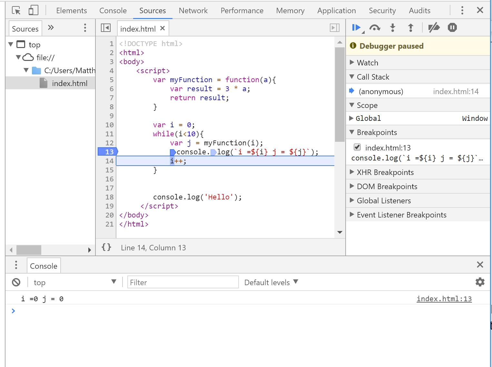

# Information & Software Technology - Learning activities

## Table of content

*2 Hardware*  
[2.2 Processing and Control - Activities](#22-processing-and-control---activities)   
[2.3 Classification of systems - Activities]( https://github.com/Quobject/boscode-doc/blob/master/doc/IST/learning_activities.md#23-classification-of-systems---activities)   
[2.4 Hardware solutions]( #24-hardware-solutions )   


*3 Software*    

[3.0 In Action Who invented the GUI?]( #30-in-action-who-invented-the-gui)    
[3.1 Software systems - Activities]( #31-software-systems---activities)    
[3.2 Types of application software - Activities]( #32-types-of-application-software---activities )    
[3.3 Features of application software - Activities]( #33-features-of-application-software---activities )    
[3.4 Interface design - Activities]( #34-interface-design---activities)    
[3.5 Features of a graphical user interface - Activities]( #35-features-of-a-graphical-user-interface---activities)    
[3.6 Operating system software - Activities]( #36-operating-system-software---activities )    
[3.7 Hardware requirements - Activities]( #37-hardware-requirements---activities )    
[3.7a Case study - The birth of computer graphics]( #37a-case-study---the-birth-of-computer-graphics)  

*4 Data handling*   

[4.4 Data storage - Activities](#44-data-storage---activities)   
[4.5 File types and data compression - Activities](#45-file-types-and-data-compression---activities)   
[4.6 File types and data compression - Activities](#46-file-types-and-data-compression---activities-1)   


*5 Past, current and emerging technologies*  

[5.2 Current and emerging technologies - Activities](#52-current-and-emerging-technologies---activities)  
[5.3 Exploring current and emerging technologies for each option](#53-exploring-current-and-emerging-technologies-for-each-option)  

*7 Issues*

[7.0 In Action Social networking]( #70-in-action-social-networking)    
[7.1 Legal issues - Activities]( #71-legal-issues---activities)    
[7.2 Ethical issues - Activities]( #72-ethical-issues---activities)    
[7.3 Social issues - Activities]( #73-social-issues---activities)  

*10 Database Design*

[10.0 In Action Data at the supermarket]( #100-in-action-data-at-the-supermarket )  
[10.1 Database development - Activities]( #101-database-development---activities)  
[10.2 Collecting, organising and storing data - Activities]( #102-collecting-organising-and-storing-data---activities )  
[10.3 Processing and analysing data - Activities]( #103-processing-and-analysing-data---activities)  
[10.4 Presenting information - Activities]( #104-presenting-information---activities)  
[10.5 Integration - Activities]( #105-integration---activities)  

*14 Robotics and automated systems*

[14 Robotics and automated systems]( #14-robotics-and-automated-systems )   
[14.0 In Action Electric humans]( #140-in-action-electric-humans )   
[14.1 Robotics - Activities]( #141-robotics---activities )   
[14.1a Issues - The changing nature of work]( #141a-issues---the-changing-nature-of-work )   
[14.1b Task 1 LEGO Mindstorms NXT]( #141b-task-1-lego-mindstorms-nxt )   
[14.2 Types of robots - Activities]( #142-types-of-robots---activities )   
[14.3 The purpose of robots - Activities]( #143-the-purpose-of-robots---activities )   
[14.3a People Animatronics engineer Grant Imahara]( #143a-people-animatronics-engineer-grant-imahara )   
[14.4 The use of robots - Activities]( #144-the-use-of-robots---activities )   
[14.4a Robots in space]( #144a-robots-in-space )   
[14.5 The function of robots - Activities]( #145-the-function-of-robots---activities )  
[14.5a People Robot developer Hugo Elias]( #145a-people-robot-developer-hugo-elias )   
[14.6 Automated control - Activities]( #146-automated-control---activities )   
[14.6a Task 2 Automated systems]( #146a-task-2-automated-systems )   
[14.6b Issues - scientists worry machines may outsmart humans]( #146b-issues---scientists-worry-machines-may-outsmart-humans )   
[14.7 Sensing devices - Activities]( #147-sensing-devices---activities )   
[14.7a Task 3 Build a traffic light with sensors]( #147a-task-3-build-a-traffic-light-with-sensors )   
[14.7b Issues - Location-based services]( #147b-issues---location-based-services )   
[14.7c Task 4 Build a car with sensors]( #147c-task-4-build-a-car-with-sensors )   
[14.8 Actuators and controlling devices - Activities]( #148-actuators-and-controlling-devices---activities )   
 

*15 Software development and programming*

[15.0 In action Finding the Titanic]( #150-in-action-finding-the-titanic)    
[15.1 People: Software developers]( #151-people-software-developers)    
[15.2 Basic programming ideas - Activities]( #152-basic-programming-ideas---activities)    
[15.3 Data types- Activities]( #153-data-types--activities)    
[15.4 Issues: Different languages]( #154-issues-different-languages)    
[15.5 Functions - Activities]( #155-functions---activities)    
[15.6 Algorithms - Activities]( #156-algorithms---activities)    
[15.7 Desk checking and subprograms - Activities]( #157-desk-checking-and-subprograms---activities)    
[15.8 GUI layout - Activities]( #158-gui-layout---activities)    
[15.9 Programming languages - Activities]( #159-programming-languages---activities)    
[15.10 Data structures - Activities]( #1510-data-structures---activities )    
[15.11 Testing program code and detecting errors - Activities]( #1511-testing-program-code-and-detecting-errors---activities)    
[15.12 Correcting errors and program documentation - Activities]( #1512-correcting-errors-and-program-documentation---activities)  
[15.13 Debugging in Chrome]( #1513-debugging-in-chrome)   

___

## 2 Hardware

### 2.2 Processing and Control - Activities

* Read chapter 2.2 Processing and Control pages 20 & 21

1 What is the motherboard? What components does it house?   
2 What functions is the CPU responsible for In a computer system?   
3 Compare the functions of RAM and ROM chips.   
4 Describe the movement of data between RAM and secondary storage while you are working on a word processing document.   
5 What are controller cards and how do they connect to the motherboard?   
6 The CPU follows a 'Fetch-Execute' cycle while it processes data. Investigate how this works. How is the data accessed and processed by the CPU?   


### 2.3 Classification of systems - Activities

* Read chapter 2.3 Classification of systems pages 22 & 23

1 Draw up a table to compare the different categories of computer hardware systems. For each category, compare physical size, cost, storage capacity, processing speed and typical applications.  
2 Investigate other devices which have microprocessors, for example a calculator and a car.  

___

### 2.4 Hardware solutions

* Read chapter 2.4 Hardware solutions pages 24 & 25

1 For each of the following scenarios, develop a hardware solution by applying the four stages of project development (Stage 1: Define the problem, Stage 2: Design some solutions, Stage 3: Produce a solution, Stage 4: Evaluation). Suggest what hardware would be required and justify your selection.  
  - A graphic designer working in an advertising agency    
  - An international airline implementing a new booking system    
  - A sales representative working across several states.    


2 List some of the more common problems that you have encountered with hardware. Discuss how best to avoid these problems in the future.    
3 Design a poster to alert users to the do's and don'ts of computer care.   


___

## 3 Software  

### 3.0 In Action Who invented the GUI?

* Read chapter 3 page 27.

1 Who first invented the GUI?   
2 How did people interact with computers before the GUI was invented?   
3 How is the GUI on today's personal computers different from earlier ones?   
 
___

### 3.1 Software systems - Activities

* Read chapter 3.1 pages 28 & 29.

1 Write a list of the most common things you use your computer for, at home and at school.   
2 Which software applications would you use to complete the tasks in question 1?   
3 Identify the three types of software that make up the software system on most desktop computers. Give an example of each.   
4 What are the most common examples of utilities found on computers?   
5 What are the differences between system utilities and application utilities?   

___

### 3.2 Types of application software - Activities

* Read chapter 3.2 pages 30 & 31.

1 What software application would you use to perform the following tasks? Justify your answers in terms of availability, cost and ease of use.   
a Write a story  
b Draw a 2D plan of your classroom.  
c Edit an image of a landscape.   
d Create an animation.   
e Edit a short film.   
f Download a web page.   
2 Apart from the application software you identified in question 1, what other software do you know of and what is its purpose?   
3 An older relative has asked your advice on the programs they should buy when they purchase a computer. Write a list of questions you might ask them before giving your advice.   
4 If you could create a new piece of software, what would be its purpose?   
5 How is new application software created?   

___
### 3.3 Features of application software - Activities

* Read chapter 3.3 pages 32 & 33.

1 Explain what the following features do in most applications: save, drag and drop, undo.   
2 Open two different software applications - one from Microsoft and one from Adobe. Make a table to compare and contrast their features. For example, how do the menus or toolboxes compare, and what can you do with one that you cannot do with the other?   
3 Investigate how each of your chosen applications can export your documents in different formats.   
4 Describe and give specific examples of how you can search your directories for phrases in documents or filenames.   
5 Record a macro in Word or Excel to add a series of formatting features to any word that is highlighted in your document.   
___

### 3.4 Interface design - Activities

* Read chapter 3.4 pages 34 & 35.

1 What is the purpose of the user interface?   
2 Briefly describe the ways in which a user interface allows us to interact with the computer.   
3 Compare interacting with an application with interacting with the operating system.   
4 Compare the three common types of user interfaces.   

___

### 3.5 Features of a graphical user interface - Activities

* Read chapter 3.5 pages 36 & 37.

1 Identify all the control elements in figure 3.18. Describe their functions.   
2 What is the difference between a radio button and a checkbox?   
3 Create your own GUI in a Word or HTML document by including some of the control elements used on a form. Alternatively, you could use a programming language such as JavaScript.   
4 Evaluate the GUI features in an application such as Photoshop. Discuss the criteria you have used with your class.   


___
### 3.6 Operating system software - Activities

* Read chapter 3.6 pages 38 & 39.

1 What operating system is installed on your computer at home? Compare this to what other members of the class have.   
2 List the tasks that an operating system usually performs on the desktop computer.   
3 Describe the sequence of events that occurs from when a user first turns on their computer to opening up an application.   
4 What are the most common types of operating systems in use today?   
5 Why don't all processors need an operating system?   

___
### 3.7 Hardware requirements - Activities

* Read chapter 3.7 pages 40 & 41.


1 What system hardware is installed in your computer - processor and RAM? You may need to look at the 'Control Panel' in Windows' main startup menu or 'About This Mac' in the Apple menu on a Mac.   
2 Why does graphics software require more processing power than other software?   
3 Look on the Microsoft website to find the system requirements for the latest version of the Office suite of applications. Do all the programs contained in this package require the same hardware standards?   
4 Open a graphics package such as Photoshop. Look under the Help menu for system information. It should indicate here how much RAM it is using.   


___
### 3.7a Case study - The birth of computer graphics

* Read chapter 3.7 page 41.


1 Identify the ways in which you interact with computer-generated images.   
2 How do the hardware components on the PDP-1 compare to today's desktop PC?   
3 Research other milestones in the history of computer-generated graphics.   


___  

## 4 Data handling

### 4.4 Data storage - Activities

* Read chapter 4.4 pages 50 & 51.

1 Draw up a table to compare RAM and ROM. List their similarities and differences.  
2 Why do computers have both primary and secondary storage?  
3 Find out how much RAM you have in your computer. If you are working in a Windows environment, you can look at this through the system properties in the control panel. For Apple® Macintosh® computers, you can find this in the Apple menu at top-left under ‘About This Mac’.  
4 Draw up a table to compare and contrast a range of primary and secondary storage media. You might include some of these headings: Examples, Location, Capacity, Speed.  
5 Draw a table to compare the cost per MB of different storage media.  
6 How is data stored on the following media?  
a) Hard disk  
b) DVD  
c) Flash memory  
7 How many bits are there in a byte?
8 How many megabytes (MB) are there in:
a) 20 gigabytes?  
b) 2 terabytes?  
c) 100 kilobytes?  

___

### 4.5 File types and data compression - Activities

* Read chapter 4.5 pages 52 & 53.

1 Identify the file extensions on some of the documents on your computer. Investigate some other file extensions such as .pdf, .exe, .mp3. What sorts of files or applications do these represent? Are there any other common file types that you use?  
2 Open one of your existing word processing documents and save it as a text file. What difference has this made to the file size? Open the text file. Which application has opened it? How is the appearance of the contents different from the original file?  
3 Save several different types of files into a compressed format; for example, a bitmap as a JPEG file, a Word file in a zip folder. Examine and compare the compression ratio of each. Which types of files does this work best for?  
4 Describe the difference between lossy and lossless compression. Why is there a need for both?  
5 Why is it important for text files not to lose data, but it is acceptable for graphics, audio and video to lose data?  
6 How big is one of your typical word processing files? How many words does it contain? Using the approximation that each ASCII character takes one byte of memory, estimate the theoretical size of your file. Are the two values roughly equal?  
7 Use a scanner to copy one of the graphics in this book. Scan it several times at different resolutions. What effect does the resolution have on the file size? What difference does it make to the quality when it is displayed on the screen?  
8 Using the graphic from the previous question, open the largest file by using a graphics package such as Adobe Photoshop. Save the graphic in different file formats and examine the file size of each. Discuss which is more important – file size or image quality.  

___

### 4.6 File types and data compression - Activities

* Read chapter 4.6 pages 54 & 55.  

1 What is the difference between serial and parallel transmission?  
2 What is the advantage of transmitting data bits in parallel? Why is this method not always used for data transmission?  
3 Compare the data transfer rates for downloading a file from the Internet to opening it from your hard drive. Why is there such a difference?  
4 Compare the different ways in which data is protected. Which of these provides the highest level of security?   
5 What is the purpose of the Privacy Act?  

___


## 5 Past, current and emerging technologies  

### 5.2 Current and emerging technologies - Activities  

* Read chapter 5.2 pages 60 - 63.  

1 Predict two information and software technology changes that you expect to see in your lifetime.  
2 Describe Moore’s law. Can it continue indefinitely?  
3 Outline three equity issues in information and software technology.  
4 What is convergence? Identify a product that displays convergence.  
5 Identify one way in which the nature of work has changed for one member of your family since you were born.  
6 Exercise your imagination and draw a picture of a typical high school classroom 25 years from now. Label the drawing with descriptions of its features.  

___

### 5.3 Exploring current and emerging technologies for each option 

* Read chapter 5.3 pages 64 - 69.   

## 7 Issues 

### 7.0 In Action Social networking

* Read chapter 7 page 79.

1 Name the types of information social networks allow us to share.   
2 Identify the advantages and disadvantages of social networking.   
3 Why is the task of removing an online post more problematic than many people realise?    
4 Investigate why so many smartphone apps request access to your location - even those that have nothing to do with maps or navigation.   
5 Businesses and advertisers can already access enormous amounts of personal data on social media websites ± from where you live to your interests and shopping habits. Sentiment analysis is now being used to mine online conversations for words and thoughts to be sold to advertisers. Discuss whether or not you consider this to be an ethical practice.   

___

### 7.1 Legal issues - Activities

* Read chapter 7.1 pages 80 & 81.

1 List four legal issues associated with developments in information and software technology.    
2 Outline the licensing arrangements that apply to most software programs.   
3 Identify five computer crimes related to security and protection of data.   
4 Discuss the importance of equal employment opportunity legislation.   
5 Investigate the landmark 2015 piracy case involving several Australian Internet service providers, including iinNet, and Dallas Buyers Club LLC. What was the outcome of this case and why was it so significant in terms of illegally downloaded videos?    

___

### 7.2 Ethical issues - Activities

* Read chapter 7.2 pages 82 & 83.

1 Discuss the importance of industry codes of conduct.   
2 Explain the difference between data security and privacy.   
3 Describe three ways in which data may be lost.   
4 Identify two examples of inappropriate use of software.   
5 Define cyber bullying and suggest a strategy that could make it less of a common or harmful occurrence among teenagers.   
6 Create a digital presentation that addresses a legal or ethical issue related to information and software technology. (You do not have to limit yourself to those mentioned above.) Keep in mind the following considerations when creating your presentation:   
- Who is your target audience?   
- Why is this issue worth researching?   
- Are there any recent news items	that you can refer to in the presentation?   
- Have you or anyone you know been directly impacted by the issue?   
7 Using	an online quiz tool such as Kahoots.it,	create an issues quiz for your classmates.   


___


### 7.3 Social issues - Activities

* Read chapter 7.3 pages 84 & 85.


1 Summarise	the changes to the nature of work	that have occurred due to advances in technology.   
2 Information and software technology is more likely to have changed someone’s work rather than eliminating it completely. List	three occupations that have been affected by technology.   
3 `Those who have regular access to information and software technology are more likely to advance, while those who do not may find themselves marginalised.` Do you agree with this statement?   
4 `Constant computer use may cause us to place more emotional value on events taking place online as opposed to what is actually happening in our real lives.` Do you agree with this statement?   
5 Present a report on the industrial issues related to the information and software technology sector. Pay particular attention to ergonomics and the rights and responsibilities of people who regularly use information technology.   

___

## 10 Database design

### 10.0 In Action Data at the supermarket

* Read chapter 10 page 147.

1 Draw up a table to identify the data about items for sale in a supermarket.   
2 When an item’s barcode is swiped at the supermarket checkout, what process must happen for its price and name to be displayed to the customer?  
3 There are many stages involved to put products on the supermarket shelf. Draw up a table to identify as many stages as you can. Include a list of people who would be involved in each stage. What data needs to be used at each stage?  
4 Why do many stores use loyalty cards? What advantage is there for the business owners? To keep track of their customers and their buying preferences. They can attract the customer back for repeated shopping visits.  
5 Many supermarkets now encourage customers to use self-checkouts. Is this a good idea? Discuss this with your class.  
6 Investigate how many people in your class use online shopping. What products do they buy, and from which companies?  


___


### 10.1 Database development - Activities

* Read chapter 10.1 pages 148 - 151.

1 What is a database? What is its most important function?  
2 Describe some of the advantages of using a database.  
3 What is the DBMS? How is it different from the database itself?  
4 List some of the databases that you would use in your daily life.  
5 How is a field different from a record?  
6 List the common data types. Which of these can be stored in a database?  
7 Draw up a table to represent a file of data about products in a supermarket.  
8 What is the difference between a flat file database and a relational database?  
9 Why do we need to separate data into the different tables in a relational database?  
10 What is a primary key used for in a database? Find out how you are uniquely identified in your school’s administration system.  
11 You would expect a hardware store to have a computerised database. What is the advantage of this for the owner? How would it benefit the customer?  
12 In the data dictionary for the student’s table in figure 10.8, what does field size refer to?  
13 The ISBN of a book is a unique identifier for a particular edition. Who controls their allocation? Are ISBN numbers issued for electronic copies of books?  
14 Look at the data types available in your database software application. List them and give an example of each. Can your database software store integers and decimal numbers? How are they different?  
15 Find out if you can use look-up lists for data entry in your database application. What are they and why are they useful?  


___

### 10.2 Collecting, organising and storing data - Activities

* Read chapter 10.2 pages 154 - 159.

1 List the common types of data sources mentioned in the text. What type of data is collected and what sort of input device is used for each?  
2 Why is it important to document data sources?  
3 What is the advantage of using automated data collection devices? Automated collection saves time and errors.  
4 What is the difference between validation and verification? Give some examples.  
5 What is redundant data? How is it eliminated?  
6 What is meant by a `key field`? What are they used for?  
7 What are some of the most common methods of storing database files?  
8 If you were travelling on a train, and an official wanted to see if your ticket was valid, what data items would he check?  
9 If you applied for a student concession card, what data would the authorities need to verify?   
10 Find an application form that is used to apply for membership to a club or health fund. How would the data be entered into the database? What chance is there of human error?   
11 Compare the file sizes of some of your databases. What effect does adding graphics to the data or headers have on the database file size?  
12 Why is it important to eliminate redundant data from databases?  
13 Why are backup procedures carried out so often in banks and large organisations?   
14 Some backup systems need to be large, while others need to be portable. Draw up a table to compare methods of backup and give examples of where they might be used.  
15 Look at one of the websites that is used for purchasing items online. List the ways in which the amount of data to be entered is minimised, and other features which work to ensure accuracy of the data collected.  


___

### 10.3 Processing and analysing data - Activities

* Read chapter 10.3 pages 160 - 165.

1 After the data is entered and stored in a database, what three processes can we perform on the data?  
2 What characteristics of the database are decided at the design stage? Why is it important to get this right?  
3 List three examples of databases in which data is edited frequently.  
4 What is meant by ‘sorting’ a database?  
5 What is meant by secondary sorting?  
6 What is a query in the context of a database? Why are they so useful?  
7 What criteria could be used to search a library catalogue?  
8 Why shouldn’t you store a person’s age in a database?  
9 What is a macro? Why are they so useful?  
10 What is the difference between a query and a filter in searching a database?  
11 The sports department at your school may need to calculate students’ ages on 31 December of each year, as only students of a certain age are allowed to compete in carnivals and competitions. Describe how you could make your database application perform this task.   
12 Give three examples of calculations that can be carried out by databases.  
13 Name two ways in which a macro can be used in a database.  
14 Construct arguments for and against the idea of having your whole life recorded in a database. It may contain health and education records, travel and professional details. How would this be of benefit to an individual? What would be the drawbacks?  
15 If a text field containing numerical data is sorted, it may result in a different order than if it was defined as a numerical data type. Try this for yourself as an experiment. Enter some numbers between 1 and 200 into a text field, then the same numbers into a numeric field. Sort the data on each field. What happens? This is a consequence of how the software represents the individual characters in memory.  


___

### 10.4 Presenting information - Activities

* Read chapter 10.4 pages 166 & 167.

1 What is the main purpose for building a report?  
2 Where does the data come from that appears on a report?   
3 Why are reports usually prepared for printing as hard copy?  
4 In what ways can reports be formatted to improve communication of information?   
5 Why are reports divided into header, data detail and footer? What information is displayed in each section?  
6 What is the main purpose of a summary report? How are they produced?  
7 Why is a report classed as having an output function? Is a form input or output or both? Justify your answer.  
8 What features of a screen interface make it easier to use a database?  
9 A supermarket docket lists store information as well as items bought by the customer. In what way can this docket be classed as a report from a database? Which parts of the docket represent the header, the body and the footer of the report?  
10 Reports are often output to pre-printed stationery. Why is this sometimes a better option than designing the headers in the database software?  
11 What happens when user interfaces are difficult to use? What does being user-friendly have to do with ergonomics?  
12 Most motor vehicle service departments give their customers a printed report listing parts used and jobs completed for each vehicle serviced. Try to find an example of one of these and design a database that could produce such a report. What is the advantage of such a report from the customer’s viewpoint? Why does the service department use pre-printed stationery to print the report?  
13 Look at the user interface on several devices in your local shopping centre – ATMs and supermarkets in particular. Draw a sketch of several examples and indicate what design features have been used to keep the interface user-friendly.  
14 Database designers often build a prototype user interface. What is a prototype? Sketch a prototype for a travel centre that specialises in cheap flights to the United States.  


___

### 10.5 Integration - Activities

* Read chapter 10.5 pages 168 - 169.

1 What is the advantage of linking media files to a database rather than importing them? What is the disadvantage?  
2 What is meant by ‘delimited text’? How is it commonly used?  
3 What is the advantage of saving a document as a text-only file?  
4 How does a mail merge function work? List the steps that you would need to create a mail merged document.  
5 What are the advantages for a marketing manager in using a mail merge option?   
6 Some schools or clubs might use a mail merge option to print mailing labels. When would this be useful?  
7 Consult the help files in your database application to see if it is able to store sound files and video clips. Which file formats does the application support?  


## 14 Robotics and automated systems  

### 14.0 In Action Electric humans

* Read chapter 14 page 291.

1 Provide a definition of a cyborg.  
2 Explain the following statement: ‘The first generation of cyborgs is already walking among us’.  
3 Identify the cybernetic technologies that are being developed and could help people with a variety of medical conditions.  
4 Outline Australia’s involvement with cybernetic technologies.  
5 Describe the ethical challenge presented by cyborg and robotic technologies.  
___

### 14.1 Robotics - Activities

* Read chapter 14.1 Robotics page 292 & 293.

1 Define the term ‘robot’.  
2 Define the term ‘robotics’.  
3 Identify the purpose of the earliest robots.  
4 Identify the component of modern robots that enables them to accept data from the environment.  
5 Name two characteristics of an intelligent robot.  
6 Identify three main features of modern robots.  
7 What was the name of the first industrial robot and in what year did it come online?  
8 Scientists have a very different view of robots from science-fiction readers and movie-goers. Explain these differences.  
9 Discuss the relevance of Asimov’s Laws of Robotics to the robotics industry today.  
10 Either write a short story involving Asimov’s Laws of Robotics or summarise the plot of I, Robot, a movie starring Will Smith, loosely based on an Asimov story.  

### 14.1a Issues - The changing nature of work  

* Read chapter 14.2 Types of robots page 296.  

1 Describe the tasks carried out by Matt Cole’s robots.  
2 If robots such as those created by Matt Cole did not exist, how would we deal with toxic accidents and the decommissioning of nuclear weapons?  
3 Automation and the development of robots for dangerous tasks, such as those described in the article, are viewed by most people as beneficial to society. However, many workers in less dangerous jobs have been made redundant by robots. Do you think the development of new robotic technologies, and their implementation, is inevitable? What, if anything, should we as a society do for those people who lose their jobs?  

___

### 14.1b Task 1 LEGO Mindstorms NXT

* Complete Task 1 on page 297

___

### 14.2 Types of robots - Activities 

* Read chapter 14.2 Types of robots page 294 & 295.


1 Identify the main difference between a robotic arm and a mobile robot.  
2 Why are robots used in industry?  
3 List four tasks performed by robots in manufacturing.  
4 Find one example of a robot used in manufacturing. For your example, answer the following questions.
  a What is manufactured?  
  b What tasks does the robot perform?  
  c Is the robot a stationary arm or a mobile robot?  

5 Find an example of a robot used for security control. Describe the function of the robot in the system.  
6 Develop and conduct a survey on the use of robots in industry and the home. Develop a chart to illustrate the findings and present them to the class.  

___

### 14.3 The purpose of robots - Activities

* Read chapter 14.3 The purpose of robots page 298.

1 Identify the industry where robots are most commonly used.  
2 Outline the reasons why robots are used in manufacturing.  
3 List four areas of robotic use today, apart from the manufacturing industry.  
4 List the reasons why robots are considered to be more reliable workers than humans.  
5 Name two dangerous tasks performed by police robots.  
6 Imagine you could have a robot that would do any task you requested – a companion to do all the work you find tedious or tiring. How do you think this might affect you as a person? Student responses will vary.  
7 Describe the types of jobs that would not be suitable for robots.  
8 Apart from the Titanic discovery, describe another situation where underwater robots have been used to locate or explore shipwrecks.  
9 Underwater robots proved invaluable following the 2010 Deepwater Horizon oil spill (also referred to as the Gulf of Mexico oil spill). Research this environmental disaster, paying particular attention to:  
	* the reasons why robots were used to contain the oil leak  
	* the difficulties encountered during the clean-up  
	* the tasks performed by the robots.  

10 Investigate the ways in which robots are used to help people with disabilities.  

___

### 14.3a People Animatronics engineer Grant Imahara

* Read chapter 14.3 The purpose of robots page 299.

1 Identify the event that changed Grant Imahara’s life.  
2 Research and provide a job description of an animatronics engineer.  
3 Research and explain the relationship between animatronics and robotics.  


___

### 14.4 The use of robots - Activities

* Read chapter 14.4 The use of robots page 300 - 302.

1 List three different areas of exploration in which robotic technologies are used.   
2 Why are robots suited to space exploration?  
3 How long have NASA’s twin robot geologists been exploring Mars?   
4 Identify the type of creature that has been the inspiration for underwater exploration robot design.  
5 Who is considered to be ‘the father’ of robotics?   
6 How are robots used to help people with disabilities?  
7 ‘Scientists would be better off spending valuable funds on developing robots to help the disabled, rather than on exploring live volcanoes.’ Do you agree or disagree with this statement? Justify your answer.  
8 Discuss the ethical issues that arise from the introduction of computer-controlled systems to replace human labour.  
9 Research some of the changes to the nature of work that began with the introduction of the first automated assembly line.  
10 How have advances in robotic and computer technology enabled surgeons to perform operations remotely on patients who may not even be in the same country?  


___

### 14.4a Robots in space

* Read chapter 14.4 The use of robots page 303.

1 Robonaut 2 is classified as a humanoid. Research and write a definition of the term ‘humanoid’.  
2 Outline the characteristics of Robonaut 2 that allow it to perform more dexterous tasks than its predecessor.  
3 Describe the features of Robonaut 2 that could be considered human-like.  

___

### 14.5 The function of robots - Activities

* Read chapter 14.5 The function of robots page 304 - 306.

1 Explain the term ‘degrees of freedom’ as it applies to robotics.  
2 Identify the number of degrees of freedom possessed by an articulated arm.  
3 List three types of end effectors.  
4 Name two ways that robots may be programmed.  
5 List the main components of a robotic system and describe the function of each.  
6 How many degrees of freedom are in a human elbow joint? Describe these movements and draw a diagram to illustrate them.  
7 Describe the difference between pick-and-place movements and point-to-point movements.  
8 Research one type of end effector used by robots. In your research include:  
  a the name of the end effector  
  b a picture or diagram  
  c an explanation of the task it performs  
  d a poster or digital presentation on the findings of your research.   

___

### 14.5a People Robot developer Hugo Elias

* Read chapter 14.5 The function of robots page 307.

1 Identify the tasks carried out by Hugo Elias in a typical day.  
2 To be an effective robot developer, Hugo Elias states that ‘academic qualifications are less important than practical experience’. Why do you think he holds this belief?  
3 Investigate the Robot Wars competition mentioned in the article. Explain the purpose of the competition and describe the robots used by participants.  


### 14.6 Automated control - Activities

* Read chapter 14.6 Automated control page 308 - 310.

1 Outline the difference between manual devices and automated systems.  
2 Using an example, outline the purpose of an automated control system.  
3 Describe three types of automated control systems.  
4 Identify four periods in the development of process control.   
5 Describe the types of automated control systems that were developed in the first four periods of automated control.  
6 Identify the advantages and disadvantages of each type of automated control system.  
7 Find one example (different from those mentioned in the text) of each type of control system — batch, continuous and discrete – and, for each example, discuss why you think this type of system is used.  
8 Research one control system and write a report. Include the category of control system, list the inputs and outputs, describe the main processes, and explain the role of the computers in the system.  
9 Research the origins of automation and create a timeline that showcases the major developments.  
10 Investigate and present a report on how modern homes are being equipped with a variety of technological tools that automate tasks.  


___

### 14.6a Task 2 Automated systems

* Read chapter 14.6 Automated control page 310.

* Task 2 Atomated systems

Write a program to control a LEGO model. The program is to control a set of traffic lights to manage vehicles at an intersection. In a later task, you will develop the model.   
1 On paper, design a set of vehicle traffic lights. Draw the lights and list the components, such as green light, amber light and red light.  
2 Write down the rules required to operate the model. For example, the light will be green for 10 seconds. Next the amber light should go-on far 2 seconds, and the red light will turn on for 10 seconds.  
3 Build the traffic light with your LEGO kit. Connect the traffic light to the computer or interface if necessary. Write the program by converting your set of written instructions to appropriate computer instructions.  
4 Run the program and document the results. Now modify the program to control a T-intersection. Remember, when the lights are green one way, they must be displaying red for the other direction. The lights must not change to red without first showing amber.  

___

### 14.6b Issues - scientists worry machines may outsmart humans

* Read chapter 14.6 Automated control page 311.

1 Identify the concerns researchers have raised in relation to advances in artificial intelligence.   
2 According to the article, what are the legitimate concerns related to technological progress and the workforce?  
3 Discuss the threat that artificial intelligent systems such as self-driving cars, software-based personal assistants and robots pose to human jobs.  
4 Do you think automated systems are benefiting humans and improving society in general or are they perhaps moving us towards a technological catastrophe?  

___

### 14.7 Sensing devices - Activities

* Read chapter 14.7 Sensing devices page 312 - 315.

1 Identify three types of sensors.  
2 Identify two types of sensing devices.  
3 Outline the purpose of chemical sensors.  
4 Explain the difference between active and passive sensors.  
5 Explain the purpose of a sensor.  
6 Explain the function of an inductance loop in a traffic light system.  
7 How are alarms activated in home security systems that contain light sensors?  
8 Toll roads with electronic payment sensors can be found in several Australian cities. Explain the purpose of a toll road system and draw a diagram to represent the system, showing its main components.  
9 Fibre-optic sensor systems are now widely used and are becoming the first choice for a range of applications. Investigate the benefits of fibre-optic sensors and identify the areas where they are in operation.  
10 Countdown timers are being trialled on pedestrian traffic lights in some parts of New South Wales. Explain how these systems operate and discuss whether or not you believe they will improve pedestrian safety.  


___


### 14.7a Task 3 Build a traffic light with sensors

* Read chapter 14.7 Task 3 Build a traffic light with sensor 312.

___

### 14.7b Issues - Location-based services

* Read chapter 14.7 Location-based servicess page 313.

1 Identify two advantages of location-based services.  
2 Provide a definition for the term ‘data harvesting’.  
3 Outline the privacy concerns associated with location-based services.  

___

### 14.7c Task 4 Build a car with sensors

* Read chapter 14.7 Task 4 Build a car with sensors page 315.

* Task 4 on page 315.

___

### 14.8 Actuators and controlling devices - Activities

* Read chapter 14.8 Actuators and controlling devices page 316 & 317.

1 Provide a definition of an actuator.  
2 What is a controlling device in a control system?  
3 What is the difference between a closed-loop system and an open-loop system?  
4 Describe the functions performed by actuators.  
5 List the actuators in your robotic kit.  
6 Think of a system that does not use feedback. Draw the system as a simple block diagram.  
7 Draw a block diagram of a closed-loop system and build it with your robotic kit.  
8 Compare and contrast how the models of open-loop and closed-loop systems function.   
9 Build an open-loop system with your robotic kit.  
10 Design and build a model with your robotic kit using the motor actuator. The model should include a sensor to control the movement of the motor. An example is a car that travels in one direction until it touches a wall, then reverses.   

___


## 15 Software development and programming


### 15.0 In action Finding the Titanic

* Read chapter 15 page 321.

1 List the three computer languages used to find the Titanic.   
2 Describe a major strength of each of these languages.   
3 What are the main similarities and differences between human languages and computer languages?   

___


### 15.1 People: Software developers

* Read chapter 15.1 pages 322 - 325.

1 Several universities offer combined degrees with computer science as one component. Find out what combinations are offered at three universities.    
2 In your own words, suggest to what extent software developers have to be `inventors` of the future.   


___

### 15.2 Basic programming ideas - Activities

* Read chapter 15.2 pages 326 - 333.

1 Identify three parts of a computer program.    
2 Identify three control structures that can be used in all programs.    
3 What are the names of the two selection control structures?    
4 What are the names of the two repetition control structures?    
5 Draw a simple flowchart to show pre-test repetition.    
6 Draw a simple flowchart to show post-test repetition.    
7 Define the term `variable`.   
8 What two things should be done with a variable before it is used in a program?    
9 Explain why it is important for a variable to be declared in a program.    
10 Explain why natural languages cannot yet be used to program a computer.    
11 Compare three computer language versions of `Hello world!` code.   
12 Research and describe the differences between an event-driven and a sequential programming language.  

___

### 15.3 Data types- Activities

* Read chapter 15.3 pages 334 & 335.

1 List the data types and variable names you might use in your programming language to hold the following data:   
a first name   
b birth date   
c URL for a web page   
d recommended retail price    
e bank balance   
f the number of printers in the network   
g the sale price for a house.  
2 Think about different ways of representing dates. Invent two ways of representing dates in a computer`s memory.   
3 Search the web for examples of how different programming languages store integers and real numbers. Provide two language examples for:   
a integer   
b long integer   
c single-precision real numbers    
d double-precision real numbers.   


___

### 15.4 Issues: Different languages

* Read chapter 15.4 pages 336 - 337.

1 How many different languages are spoken by the peoples of the world?   
2 What are the five top-ranking languages, in terms of the number of people who speak them? Rank Language Native speakers (millions) % of world population.   
3 What international equity issues are involved in this issue of software and languages?    
4 The English language uses words composed of combinations of letters from a 26-letter alphabet. The QWERTY keyboard is well suited to this. Find out how modern computers and software can be made to work with languages using a different alphabet.   


___

### 15.5 Functions - Activities

* Read chapter 15.5 pages 338 & 339.

1 Give examples of the symbol used for `not equal to` in various languages.   
2 Give three examples of arithmetic operators.   
3 Give three examples of relational operators.   
4 Give three examples of logical operators.   
5 What is concatenation?   
6 Use pseudocode to give an example of an assignment statement.   
7 What is the purpose of a counter?   
8 What is the purpose of a function?   
9 Give an example of an input function.   
10 Give an example of an output function.   
11 Work out what the following line of code might do:   
`SalePrice = RRP - (RRP * DiscountRate)`    
12 Work out what the following line of code might do:    
`TimeTaken = TimeFinished - TimeStarted`    
13 Find out about five useful functions used in your programming language, and prepare a short table summarising how these functions can be used.      


___

### 15.6 Algorithms - Activities

* Read chapter 15. pages 340 - 343.

1 Define the term 'algorithm'.   
2 What are two ways to represent an algorithm?   
3 Draw and describe each of the symbols used in flowcharting.    
4 What are the differences between pseudocode and ordinary English?   
5 Write an algorithm expressed in flowchart form for finding the largest of four integers.    

___

### 15.7 Desk checking and subprograms - Activities

* Read chapter 15.7 pages 346 - 349.

1 What is the purpose of desk checking?   
2 Describe the steps involved in performing a desk check on a program.   
3 What are the main reasons for using subprograms?   
4 Functions are different to ordinary subprograms in that they return a value. Explain why some subprograms don`t need to return a value.   
5 Find out about the syntax for subprograms in the language you are using.   
6 Find out why the GOTO statement is regarded as bad practice in programming.   


___

### 15.8 GUI layout - Activities

* Read chapter 15.8 pages 350 - 351.

1 Identify two types of GUI.   
2 Identify four elements in a WIMP GUI.   
3 Why might WIMP be unsuitable as the user interface for a touchscreen phone using fingers as a pointer?   
4 List the GUI elements used on a standard smartphone application.   

___

### 15.9 Programming languages - Activities

* Read chapter 15.9 pages 352 - 353.


1 What is source code?   
2 What is object code?   
3 What was the world`s first universal computer language?   
4 What should be considered when choosing a computer language for a project?   


___

### 15.10 Data structures - Activities

* Read chapter 15.10 pages 354 & 355.

1 What is the difference between an array and a record?   
2 How do you declare an array in Javascript?   
3 Give examples of the use of an array and a record (Javascript object) structure in a program.   
4 Find out about the rules for using arrays in the language you are using.     


___

### 15.11 Testing program code and detecting errors - Activities

* Read chapter 15.11 pages 356 & 357.


1 Identify three types of programming errors.   
2 At what point in the development of a program does a programmer discover a run-time error?   
3 How can syntax errors be avoided?   
4 How can logical errors be avoided?   
5 Find out the meaning of the term `computer bug` and research when this term was first used and by whom.   


___

### 15.12 Correcting errors and program documentation - Activities

* Read chapter 15.12 pages 358 & 359.


1 Identify three tools commonly found in an IDE`s debugger.   
2 What is the difference between a stub and a flag?   
3 Name two internal forms and one external form of documentation used by programmers.   
4 What is the difference between using a debugger and using stubs, flags and debugging output statements to find errors?   
5 What is one important feature of intrinsic documentation and why is it important?   
6 Find out about the debugging tools available in the programming language you are using, and describe how they are used.   
7 Find out about the documentation tools available in the programming language you are using, and describe how they are used, showing examples.   

___

### 15.13 Debugging in Chrome   

1 On your desctop create text file `index.html`.   
2 Add the following code: 

```
<!DOCTYPE html>
<html>
<body>
    <script>
        var myFunction = function(a){
            var result = 3 * a;
            return result;
        }

        var i = 0;
        while(i<10){
            var j = myFunction(i);
            console.log(`i =${i} j = ${j}`);
            i++;
        }


        console.log('Hello');
     </script>
</body>
</html>
```

3 Right click the file and `Open in Chrome`.   
4 Open `Developer Tools` Ctrl-Shift-I.   
 
  

 5 Practice the following tools:
   - use of breakpoints   
   - resetting variable contents
   - program traces
   - single line stepping


