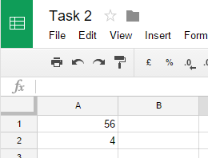
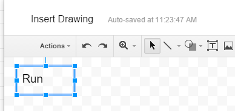
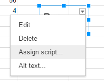
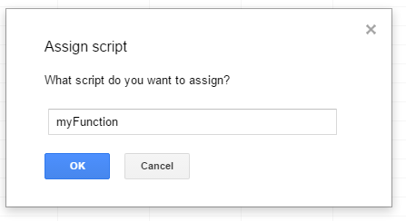
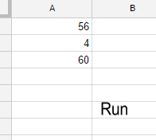
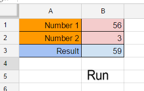
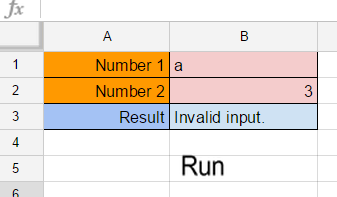
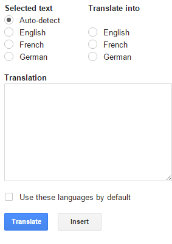
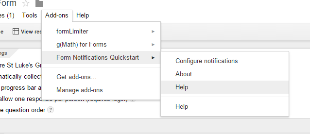
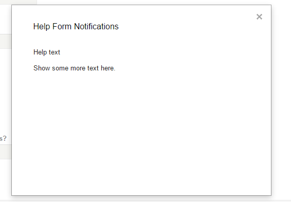

# Google Apps Script Tasks

## Table of Content

[01 Overview of Google Apps Script]()  
[02 Adding numbers with Google Apps Script]()  
[03 Add-on for Google Docs]()  
[04 Add-on for Google Forms]()  
[05 Macros, Menus, and Custom Functions]()  

___

## 01 Overview of Google Apps Script

Go through the information provided at https://developers.google.com/apps-script/overview
and create your first script.


___

## 02 Adding numbers with Google Apps Script


1. In google drive create a new folder “Google script task 2”.  
2. Inside this new folder create a new Google Sheets “Task 2” document.  
3. Write 56 into cell A1 and 4 into cell A2:  
  

4. Select the menu item Tools → Script editor… . If you are presented with a welcome screen, click `Blank Project`.  
5. Delete any code in the script editor and paste in the code below.
   
  ```js
  function myFunction() {
    var spreadsheet = SpreadsheetApp.getActive();
    var sheet = spreadsheet.getSheetByName('Sheet1');
    sheet.activate();
  
    //https://developers.google.com/apps-script/reference/spreadsheet/sheet#getRange(String)
    var range = sheet.getRange("A1");
    var value = range.getValue();
    var a1 = parseInt(value);
    Logger.log('a1=' + a1);

    range = sheet.getRange("A2");
    value = range.getValue();
    a2 = parseInt(value);
    Logger.log('a2=' + a2);
  
    var result = a1 + a2;
  
    var cell = sheet.getRange("A3");
    cell.setValue(result);  
  }
  ```

6. Select the menu item File → Save. Name your new script “Task 2 script” and click OK.
7. Select the menu item Insert → Drawing… .	
8. Type the word “Run”:  

  

9. Press the button `Save & Close`

  

10. Right click the inserted drawing, click on the triangle on the right upper corner and select Assign script… .  

  


11. Type ‘myFunction’:

  

12. Click OK.  
13. Left click the drawing to run the script:

  

14. Modify the sheet and script to make a nicer user interface e.g.:  

  


15. Add data validation to your code by using the [isNaN() function](http://www.w3schools.com/jsref/jsref_isnan.asp):  

  

___

## 03 Add-on for Google Docs

1. Follow instruction given at https://developers.google.com/apps-script/quickstart/docs.  
2. Read the code and html files and try to understand what each function does.
3. Modify the code.gs so that the sidebar will show immediately when the document is opened (the user should not have to click the ‘Start’ menu item anymore). Paste your modified function code into your solution document.  
4. Modify the scripts to remove the languages “Japanese” and “Spanish”.  

  

___

## 04 Add-on for Google Forms

1. Follow instruction given at https://developers.google.com/apps-script/quickstart/forms-add-on  
2. Read the code and html files and try to understand what each function does.  
3. Modify the code so that a help menu item will be shown:   

  

4. Hitting this menu item should bring up a box like this:  

  

5. Paste your code for the modified js/html functions into your solution document.


___

## 05 Macros, Menus, and Custom Functions

1. Follow instruction given at https://developers.google.com/apps-script/quickstart/macros  
2. Read the code and html files and try to understand what each function does.  
