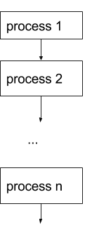

## Table of content

http://bit.ly/2jjSsuv

*1 Pseudocode*  

[Pseudocode guidelines](#pseudocode-guidelines)     
[Sequence](#sequence)     
[Binary selection](#binary-selection)    
[Casewhere](#casewhere)          
[Pre-test repetition: while](#pre-test-repetition-while)         
[Post-test repetition: repeat](#post-test-repetition-repeat)         
[FOR/NEXT or counted loop](#fornext-or-counted-loop)         
[Subprogram](#subprogram)         
[Load array](#load-array)         
[Print array contents](#print-array-contents)         
[Add the contents of an array](#add-the-contents-of-an-array)         
[Find maximum value in an array](#find-maximum-value-in-an-array)         
[Find minimum value in an array](#find-minimum-value-in-an-array)         
[Creating a sequential file](#creating-a-sequential-file)         
[Printing the contents of a file using sentinel value](#printing-the-contents-of-a-file-using-sentinel-value)         
[Printing the contents of a file using EOF (end of file)         ](#printing-the-contents-of-a-file-using-eof-end-of-file)         
[Appending rows to an existing sequential file](#appending-rows-to-an-existing-sequential-file)         
[Creating a relative file](#creating-a-relative-file)         
[Reading from a relative file](#reading-from-a-relative-file)         
[Updating records in a relative file](#updating-records-in-a-relative-file)         

*2 Desk checks*

[2 Desk check](#2-desk-check)

[2.1 Desk check 1](#21-desk-check-1)  
[2.2 Desk check 2](#22-desk-check-2)  
[2.3 Desk check 3](#23-desk-check-3)  
[2.4 Desk check 4](#24-desk-check-4)  
[2.5 Desk check 5](#25-desk-check-5)  
[2.6 Desk check 6](#26-desk-check-6)  
[2.7 Desk check 7](#27-desk-check-7)  
[2.8 Desk check 8](#28-desk-check-8)  
[2.9 Desk check 9](#29-desk-check-9)  
[2.10 Desk check 10](#210-desk-check-10)  
[2.11 Desk check 11](#211-desk-check-11)  
[2.12 Desk check 12](#212-desk-check-12)  
[2.13 Desk check 13](#213-desk-check-13)  
[2.14 Desk check 14](#214-desk-check-14)  
[2.15 Desk check 15](#215-desk-check-15)  
[2.16 Desk check 16](#216-desk-check-16)  
[2.17 Desk check 17](#217-desk-check-17)  
[2.18 Desk check 18](#218-desk-check-18)  
[2.19 Desk check 19](#219-desk-check-19)  
[2.20 Desk check 20](#220-desk-check-20)  
[2.21 Desk check 21](#221-desk-check-21)  
[2.22 Desk check 22](#222-desk-check-22)  
[2.23 Desk check 23](#223-desk-check-23)  
[2.24 Desk check 24](#224-desk-check-24)  
[2.25 Desk check 25](#225-desk-check-25)  
[2.26 Desk check 26](#226-desk-check-26)  

*3 Algorithm Flowcharts*


# 1 Pseudocode
It is expected that students are able to develop and interpret algorithms using pseudocode and flowcharts.

## Pseudocode guidelines
The pseudocode keywords are:

* for each procedure or subroutine
```
BEGIN name
END name
```
* for binary selection
```
IF condition THEN
  statements
ELSE
  statements
ENDIF
```
* for multi-way selection
```
CASEWHERE expression evaluates to
  A: process A
  B: process B
  ....
  OTHERWISE: process ...
ENDCASE
```
* for pre-test repetition
```
WHILE condition
  statements
ENDWHILE
```
* for post-test repetition
```
REPEAT
  statements
UNTIL condition
```
* for FOR/NEXT loops
```
FOR variable = start TO finish STEP increment
  statements
NEXT variable
```

In pseudocode:
* keywords are written in capitals
* structural elements come in pairs, eg for every BEGIN there is an END, for every IF there is an ENDIF.
* indenting is used to identify control structures in the algorithm
* the names of subprograms are underlined. This means that when refining the solution to a problem, a subroutine can be referred to in an algorithm by underlining its name, and a separate subprogram developed to show the logic of that routine. This feature enables the use of the top-down development concept, where details for a particular process need only be considered within the relevant subroutine.
*

___

## Examples

### Sequence 
```
Get firstNumber
Get secondNumber
sum = firstNumber + secondNumber
Display "the sum of your 2 numbers is ", sum
```

___

### Binary selection
```
myguess = 7
Get guess
IF guess = myguess THEN
  Display "Well done — you guessed my number!"
ELSE
  Display "That is not correct"
ENDIF
```

___

### Casewhere
```

N = 20  

CASEWHERE n is    
  less than 10 : n = n + 5
  30 : Display "n is thirty"
  greater than 50 : n = n + 30    
  OTHERWISE : n = n + 50  
ENDCASE  

Display n 

```

___

### Pre-test repetition: while
```
number = 5 

WHILE number < 200  
  Display number  
  Increment number by 2 
ENDWHILE 
	
```

___

### Post-test repetition: repeat
```
number = 0

REPEAT  
  Display number  
  number = number + 2 
UNTIL number > 200 
```

___

### FOR/NEXT or counted loop
```
FOR i = 1 to 12 STEP 1
  Display "12 x ", i," = ", (12 * i) 
NEXT i
```

___

### Subprogram
```
BEGIN Main
  Get a
  Get b
  Sum(a,b,c)
  Display "a + b = ", c
END Main

BEGIN Sum(a,b,c)
  c = a + b
END Sum
```
Note: The word <u>Sum</u> should be underlined in the above code
___

### Load array
```
BEGIN LoadArray
  i = 1
  Get DataValue
  WHILE DataValue < > "xxx"
    element(i) = DataValue
    i = i + 1
    Get DataValue
  ENDWHILE
  numElements = i
  Display "There are", numElements, " items loaded into the array" 
END LoadArray

```

___

### Print array contents
```
BEGIN PrintArrayContents
  element(1) = 3
  element(2) = 7
  element(3) = 10

  i = 1
  WHILE i <= 3
    Display element(i) 
    i = i + 1
  ENDWHILE
END PrintArrayContents
```

___

### Add the contents of an array
```
BEGIN SumArrayContents
  element(1) = 3
  element(2) = 7
  element(3) = 10

  i = 1
  sum = 0

  WHILE i <= 3
    sum = sum + element(i)
    i = i + 1
  ENDWHILE  

  Display "The sum of all of the elements in the array = " , sum 

END SumArrayContents
```

___

### Find maximum value in an array
```
BEGIN FindMAX
  element(1) = 3
  element(2) = 7
  element(3) = 23
  element(4) = 3
  element(5) = 7
  element(6) = 10

  maxIndex = 1
  i = 2 
  WHILE i < 7
    IF element(i) > element(maxIndex) THEN
      maxIndex = i
    END IF
    
    i = i + 1
  ENDWHILE

  max = element(maxIndex)
  Display "The highest value is ", max, " at position ", maxIndex 

END FindMAX
```
___

### Find minimum value in an array
```
BEGIN FindMIN
  element(1) = 3
  element(2) = 7
  element(3) = 23
  element(4) = 3
  element(5) = 7
  element(6) = 10

  maxIndex = 1
  i = 2 
  WHILE i < 7
    IF element(i) < element(maxIndex) THEN
      maxIndex = i
    END IF
    
    i = i + 1
  ENDWHILE

  max = element(maxIndex)
  Display "The highest value is ", max, " at position ", maxIndex 

END FindMIN
```

___

## Sequential file


### Creating a sequential file

Pseudocode
```
BEGIN CreateASequentialFile
  Open FriendsData for output

  firstName = "Joe"
  lastName = "Bloggs"
  emailAddress = "jbloggs@example.com"

  Write FriendsData from firstName, lastName, emailAddress

  firstName = "Jim"
  lastName = "Doe"
  emailAddress = "jdoe@example.com"

  Write FriendsData from firstName, lastName, emailAddress

  Close FriendsData
END CreateASequentialFile


```

___

### Printing the contents of a file using sentinel value

Pseudocode
```
BEGIN DisplayFileContents
  Open FriendsData for input

  Read firstName, lastName, emailAddress from FriendsData
  ’This is a priming read, performed just before entering the loop to provide
  'the first record (if there is one) for printing

  WHILE firstName <> “xxx”
    Display firstName, lastName, emailAddress
    Read firstName, lastName, emailAddress from FriendsData
    ’this reads subsequent records which can then be tested for the sentinel
    'value before they are processed
  END WHILE

  Close FriendsData
END DisplayFileContents

```

___

### Printing the contents of a file using EOF (end of file)

Pseudocode
```
BEGIN DisplayFileContents
  Open FriendsData for input

  Read firstName, lastName, emailAddress from FriendsData
  ’This is a priming read, performed just before entering the loop to provide
  'the first record (if there is one) for printing

  WHILE not EOF
    Display firstName, lastName, emailAddress
    Read firstName, lastName, emailAddress from FriendsData
    ’this reads subsequent records which can then be tested for the sentinel
    'value before they are processed
  END WHILE

  Close FriendsData
END DisplayFileContents

```

___


### Appending rows to an existing sequential file

Pseudocode
```
BEGIN AppendNewRows
  Open FriendsData for append

  Display “Please enter the details for the first new person to be added:”
  Display “Enter xxx for first name to indicate there are no more rows to be added.”

  Get firstName, lastName, emailAddress

  WHILE firstName <> “xxx”
    Write FriendsData from firstName, lastName, emailAddress

    Display “Please enter the details for the next new person to be added:”

    Get firstName, lastName, emailAddress
  END WHILE

  Close FriendsData
END AppendNewRows
```

___

## Relative file

### Creating a relative file

Pseudocode
```
BEGIN CreateARelativeFile
  Open ProductData for relative access

  productNumber = 1
  description = "Laundry Liquid 2L"
  quantity = 100
  price = 1.49

  Write ProductData from productNumber, description, quantity, price using productNumber

  ’note the use of the variable productNumber as the key field, specifying where this record will be written in the file.

  productNumber = 2
  description = "Mate Laundry Liquid 1L"
  quantity = 300
  price = 3.99

  Write ProductData from productNumber, description, quantity, price using productNumber

  Close ProductData
END CreateARelativeFile
```
___

### Reading from a relative file

Pseudocode
```
BEGIN ReadRecordsFromARelativeFile
  Open ProductData for relative access

  RequiredProdNumber = 1

  Read ProductData into productNumber, description, quantity, price using RequiredProdNumber
  ’note the use of the variable RequiredProdNumber as the key field, specifying where this record will be found in the file
  
  IF RecordNotFound THEN
    ’note the use of the flag RecordNotFound returned by the operating system 
    Display “Sorry – no such product”
  ELSE
    Display productNumber, description, quantity, price
  END IF
  
  Close ProductData
END ReadRecordsFromARelativeFile

```

___

### Updating records in a relative file

Pseudocode
```
BEGIN UpdateRecordsInARelativeFile
  Open ProductData for relative access

  RequiredProdNumber = 1

  Read ProductData into productNumber, description, quantity, price using RequiredProdNumber
  
  IF RecordNotFound THEN
    'note the use of the flag RecordNotFound returned by the operating system 
    Display “Sorry – no such product”
  ELSE
    Display productNumber, description, quantity, price
    newPrice = 1000

    Write ProductData from productNumber, description, quantity, newPrice using productNumber
    'update record using data for the new price and the existing data in the other fields

  END IF
  
  Close ProductData
END UpdateRecordsInARelativeFile

```
___


___  
## 2 Desk check

### 2.1 Desk check 1

Consider this fragment of code

```
BEGIN
  length = 0
  breadth = 0
  area = length * breadth
  length = 5
  breadth = 4
END
```

1. Complete a desk check  
2. What are the values of length, breadth and area after the fragment of code has been executed?

___

### 2.2 Desk check 2

Consider this fragment of code

```
BEGIN
  m = 1
  p = 2
  m = p
  p = m
END
```

1. Complete a desk check  
2. What are the values of m and p after the fragment of code has been executed?

___

### 2.3 Desk check 3

Consider this fragment of code

```
BEGIN
  a = 2
  b = 4
  a = a + b
  b = a + b
  Display a, b
END
```

1. Complete a desk check  
2. What is the output from this fragment of code?

___

### 2.4 Desk check 4

Consider this algorithm

```
BEGIN
  x = 4
  y = x
  z = x * y
  Display z
END
```

1. Complete a desk check  
2. What is the output from this fragment of code?

___

### 2.5 Desk check 5

Consider this algorithm

```
BEGIN
  Get x
  WHILE x > 5
    Display x + 3
    x = x - 1
  ENDWHILE
END
```

1. Using the test data x = 7, complete a desk check.  
2. What is the output?


___


### 2.6 Desk check 6

Consider this algorithm

```
BEGIN
  n = 20
  CASEWHERE n is
    less than 10: n = n + 50
    less than 30: n = n + 10
    less than 50: n = n + 30
    OTHERWISE:    n = n + 50
  ENDCASE
  Display n
END
```

1. Complete a desk check  
2. What is the output after the fragment of code has been executed?

___


### 2.7 Desk check 7

Consider this algorithm

```
BEGIN
  number = 5
  WHILE number < 30
    Display number
    Increment number by 2
  ENDWHILE  
END
```

1. Complete a desk check  
2. What is the output after the fragment of code has been executed?

___


### 2.8 Desk check 8

Consider this algorithm

```
BEGIN
  number = -2
  REPEAT
    Display number
    number = number + 2
  UNTIL number > 10
END
```

1. Complete a desk check  
2. What is the output after the fragment of code has been executed?

___


### 2.9 Desk check 9

Consider this algorithm

```
BEGIN
  FOR number = 2 TO 10 STEP 1
    Display number * 2 + 1
  NEXT number
END
```

1. Complete a desk check  
2. What is the output after the fragment of code has been executed?

___


### 2.10 Desk check 10

Consider this algorithm

```
BEGIN
  number = 5
  REPEAT
    Display number
    Increment number by 2
  UNTIL number = 10  
END
```

1. Complete a desk check  
2. What is the output after the fragment of code has been executed?

___


### 2.11 Desk check 11

Consider this algorithm

```
BEGIN
  FOR number = 5 TO 13 STEP 2
    Display number
  NEXT number
END
```

1. Complete a desk check  
2. What is the output after the fragment of code has been executed?

___


### 2.12 Desk check 12

Consider this algorithm

```
BEGIN
  start = 4
  finish = 10
  WHILE start < finish
    start = finish - start
    finish = finish - 2
  ENDWHILE
END
```

1. Complete a desk check  
2. How many times will the statement within the body of the loop be executed?

___


### 2.13 Desk check 13

Consider this algorithm

```
BEGIN
  a = 1
  b = 2
  c = 3
  a = b
  c = a
  b = c
  Display a, b, c
END

```

1. Complete a desk check  
2. What is the output after the fragment of code has been executed?

___


### 2.14 Desk check 14

Consider this algorithm

```
BEGIN
  a = 10
  b = a - 2
  c = b / 2
  a = c + 5
  b = a - b
  Display b
END
```

1. Complete a desk check  
2. What is the output after the fragment of code has been executed?

___


### 2.15 Desk check 15

Consider this algorithm

```
BEGIN
  count = 10
  num = 10
  WHILE count > 0
    Display num - count
    count =  count - 2
  ENDWHILE
END
```

1. Complete a desk check  
2. What is the output after the fragment of code has been executed?

___


### 2.16 Desk check 16

Consider this algorithm

```
BEGIN
  count = 11
  num = 10
  WHILE count > 0
    count =  count - 2
    Display num - count
  ENDWHILE
END
```

1. Complete a desk check  
2. What is the output after the fragment of code has been executed?

___


### 2.17 Desk check 17

Consider this algorithm

```
BEGIN
  count = 10
  num = 10
  WHILE count > 0
    count =  count - 3
    Display num - count    
  ENDWHILE
END
```

1. Complete a desk check  
2. What is the output after the fragment of code has been executed?

___


### 2.18 Desk check 18

Consider this algorithm

```
BEGIN
  count = 10
  num = 10
  WHILE count > 0
    count =  count - 2
    Display num - count    
  ENDWHILE
END
```

1. Complete a desk check  
2. What is the output after the fragment of code has been executed?

___


### 2.19 Desk check 19

Consider this algorithm

```
BEGIN
  Get a
  Get b
  WHILE a < b
    Display a
    a = a + 3
  ENDWHILE 
END
```

1. Complete a desk check with the input 2 and 14. 
2. What is the output after the fragment of code has been executed with the input 2 and 14?

___


### 2.20 Desk check 20

Consider this algorithm

```
BEGIN
  Get a
  WHILE a > 0
    b = a * 2
    a = a - 1
    Display b
  ENDWHILE
END

```

1. Complete a desk check with the input 3. 
2. What is the output after the fragment of code has been executed with the input 3?

___


### 2.21 Desk check 21

a MOD b returns the remainder from the division a/b. For example, 11 MOD 4 = 3 because 11/4 = 2 remainder 3.

Consider this algorithm

```
BEGIN
  a = 15
  WHILE a > 1
    IF a MOD 2 = 0 THEN
      Display a
    ELSE
      a = a - 1
    ENDIF
  ENDWHILE
END
```

1. Complete a desk check  
2. What is the output after the fragment of code has been executed?

___


### 2.22 Desk check 22

Consider this algorithm

```
BEGIN
  x(1) = "a"
  x(2) = "b"
  x(3) = "c"
  x(4) = "d"
  x(5) = "e"

  i = 1
  j = number of elements in the array x
  WHILE i < j
    k = x(i)
    x(i) = x(j)
    x(j) = k
    i = i + 1
    j = j - 1
  ENDWHILE
END 
```

1. Complete a desk check  
2. Which of the following best describes what this code does?  
(A) It reverses the order of the elements in the array.  
(B) It copies the second half of th the array to the first half.  
(C) It copies the first half of the array to the second half.  
(D) It swaps the first half of the array and the second half of the array.  

___

### 2.23 Desk check 23

Consider this algorithm.

```
BEGIN order
  names(1) = "Smith" 
  names(2) = "Farelli" 
  names(3) = "Wu" 
  names(4) = "Andrews" 
  
  position = 1
  end = number of elements in the array names
  WHILE position < end
    current = position + 1
    maximum = position

    WHILE current <= end
      IF names(current) > names(maximum) THEN
        maximum = current
      ENDIF
      current = current + 1
    ENDWHILE
    `NOTE: the subprogram swap exchanges two elements of the array 'names'. 
    ` swap should be underlined
    swap(names, maximum, position)
    position = position + 1
  ENDWHILE
END order
```

1. Complete a desk check  

___


### 2.24 Desk check 24

Consider this algorithm

```
BEGIN main
  numA = 2
  numB = 3
  calc(numA, numB)
  Display numA, numB
END main

BEGIN calc(numC, numD)
  temp = numC
  WHILE numD > 1
    numC = numC * temp
    numD = numD - 1
  ENDWHILE
  Display numC, numD
END calc
```

1. Complete a desk check  
2. What is the output after the fragment of code has been executed?

___


### 2.25 Desk check 25

Consider this algorithm

```
BEGIN 
  list(1) = 1
  list(2) = 3
  list(3) = 5
  list(4) = 7
  list(5) = 9

  low = 1
  n = number of elements in the array list
  high = n
  WHILE low < n 
    list(low) = list(high)
    list(high) = list(low)
    low = low + 1
    high = high - 1
  ENDWHILE
END
```

1. Complete a desk check  


___


### 2.26 Desk check 26

Consider this algorithm

```
BEGIN
  a(1) = 1
  a(2) = 1
  i = 3
  WHILE i <= 10
    a(i) = a(i-1) + a(i-2)
    i = i + 1
  ENDWHILE
END
```

1. Complete a desk check  

___


# 3 Algorithm Flowcharts
It is expected that students are able to develop and interpret algorithms using pseudocode and flowcharts.

Flowcharts are a diagrammatic method representing algorithms, which are read from top to bottom and left to right. 
 
## Flowchart elements 
 
Flowcharts use the following symbols connected by lines with arrowheads to indicate the flow. It is common practice to show arrowheads to avoid ambiguity. 
 

 
 
Flowcharts using these symbols should be developed using only the standard control structures (described on the following pages). 
 
It is important to start any complex algorithm with a clear, uncluttered main line. This should reference the required subroutines, whose detail is shown in separate flowcharts.  
 
A subroutine should rarely require more than one page, if it correctly makes use of further subroutines for detailed logic.   


## Control structures 
 
Algorithms are developed using the basic control structures of sequence, selection, repetition and subprograms. A description of each of these structures, together with examples of their use, follows. 
 
### Sequence 
 
In a computer program or an algorithm, sequence involves simple steps which are to be executed one after the other. The steps are executed in the same order in which they are written. 

*Pseudocode*
```
process 1
process 2
...
...
process n
``` 
*Flowchart*




The arrowheads are optional if the flow is top-to-bottom. 
 
*Example using squence*
 
*Problem*
 
Write a set of instructions to add two numbers and display the answer. 
 
*Pseudocode *
```
BEGIN Add2Numbers 
  get firstNumber 
  get secondNumber 
  total = firstNumber + secondNumber 
  Display “the sum of your 2 numbers is ”; total 
END Add2Numbers 
```
 
*Flowchart*


